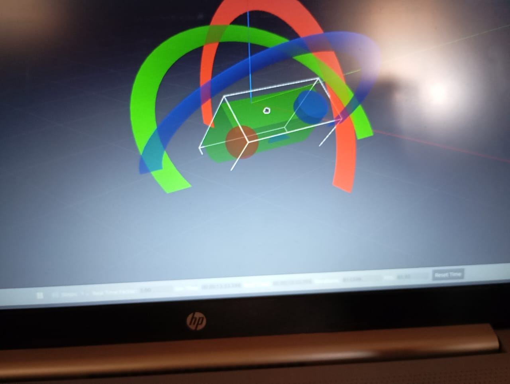

# Differential_Drive_Robot

This mini project simulates a **2-wheel differential drive robot** using **ROS 2 (Humble)** and **Gazebo**. 
## 📁 Folder Structure
```bash
ws_ddmobile/
├── src/
│   └── mobile_dd_robot/
│       ├── include/
│       ├── launch/
│       │   └── gazebo_model.launch.py
│       ├── model/
│       │   ├── robot.xacro
│       │   └── robot.gazebo
│       ├── src/
│       ├── CMakeLists.txt
│       └── package.xml



## 🧰 Tech Stack

<p align="left">
  
  
  
  
</p>
